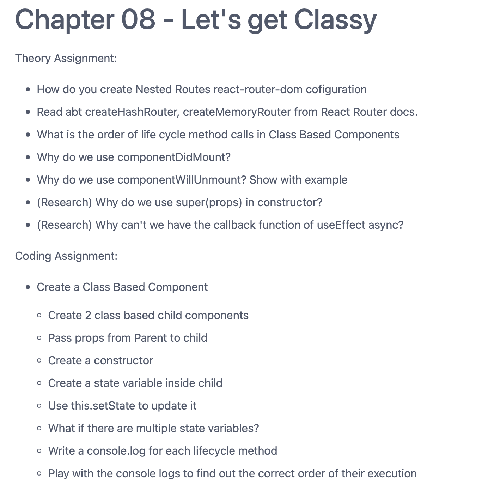
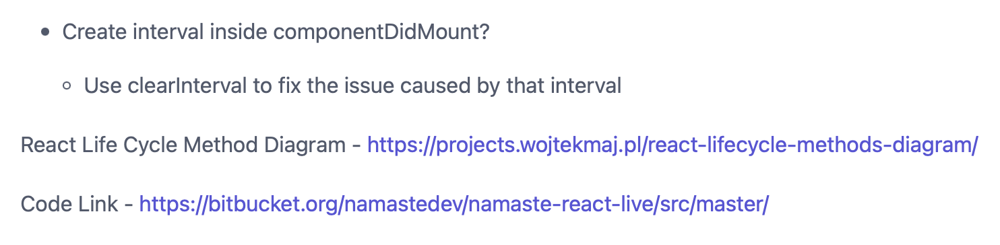
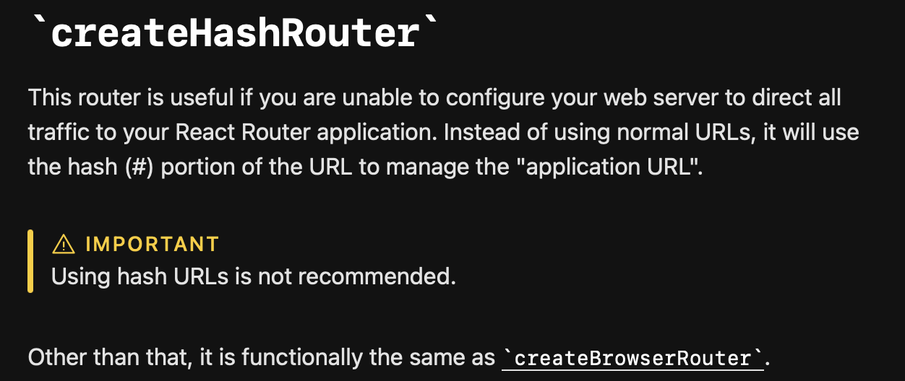

# Session 8 ⇒ 22/01/23





# Nested Routes ⇒ ***`Routes Inside Routes`***

```jsx
cconst appRouter = createBrowserRouter([
  {
    path: "/",
    element: <AppLayout />,
    errorElement: <Error />,
    children: [
      {
        path: "/",
        element: <Body />,
        errorElement: <Error />,
      },
      {
        path: "about",
        element: <Suspense><About /></Suspense>,
        errorElement: <Error />,
        children: [
           {
             path: "profile", // localhost:1234/about/profile   i.e. parentPath/{path}
             element: <Profile />
           }
         ],
      },
      {
        path: "/contact",
        element: <Contact />,
        errorElement: <Error />,
      },
    ],
  },
]);
```

# [createHashRouter](https://reactrouter.com/en/main/routers/create-hash-router#createhashrouter)



# [createMemoryRouter](https://reactrouter.com/en/main/routers/create-memory-router#creatememoryrouter)


# Order of [Lifecycle Methods](https://projects.wojtekmaj.pl/react-lifecycle-methods-diagram/) :

Red ⇒ Render Phase

Green ⇒ Commit Phase

## In case of One Parent and One Child :

1. Parent Constructor       
2. Parent Render
3. Child Constructor 
4. Child Render
5. Child ComponentDidMount
6. Parent ComponentDidMount

## In case of One Parent and Two Child :

1. Parent Constructor 
2. Parent Render
3. Child1 Constructor 
4. Child1 Render
5. Child2 Constructor 
6. Child2 Render
7. Child1 ComponentDidMount
8. Child2 ComponentDidMount
9. Parent ComponentDidMount

# Component Did Mount

→ Called ***`After Initial Render`***

→ Therefore, we can make an `***API Call***` Inside Component Did Mount.

→ As we want our application to load with ***`some initial data`*** → ***`make an api call`*** → and then `***get loaded with the newer data***`.

→ We can make it ***`async`***.

# Component Will Unmount

→ To be ***`called when we leave a component`***.

→ Therefore, it is used to ***`ensure Cleanup`***.

```jsx
componentDidMount() {
	
	this.timer = setInterval(() => {
		console.log("Namaste React OP!");
	}, 1000);

	console.log("Inside ComponentDidMount!");

}

/* Now, this setInterval is called every time we change components in our 
 Single Page Application.  

	This would cause severe performance issues.
	
  So, in order to avoid such issues, we would define a clearInterval inside the 
	componentWillUnmount(). */ 

componentWillUnmount() {
	clearInterval(this.timer);
	console.log("Inside ComponentWillUnmount!");
}
```

# Why 🤔 `super(props)` ?

**JavaScript enforces that if you want to use `this` in a constructor, you *have to* call `super` first.**  Let the parent do its thing!

```jsx
  constructor(props) {
		// can't use `this` here
    super(props);
    // ✅ Okay to use `this` now
    this.state = { isOn: true };
  }
```

Okay! We understood the importance of `**super()**` but then is it necessary to pass props as well ? 

Not necessary, but in order to avoid situations wherein the constructor is calling some methods and need to access `**this.props**` then it might happen that if we didn’t pass props to super() then `**this.props will become undefined**` (however, `**props**` could be used).

```jsx
  constructor(props) {
		// can't use `this` here
    super();
		// console.log(this.props); 🔴 Not Okay!
    console.log(props); // ✅ Okay!
  }
```

**Must Read :** 

[Why Do We Write super(props)?](https://overreacted.io/why-do-we-write-super-props/)

# Why can’t we define the callback function of useEffect Hook as Async ?

```jsx
// ❌ Don't do this!
useEffect(async () => {
	const users = await fetchUsers();
	setUsers(users);
	
	return () => {
	// this never gets called, hello memory leaks...
	};
}, []);
```

```jsx
// 🆗 Ship it
useEffect(() => {
  (async () => {
    const users = await fetchUsers();
    setUsers(users);
  })();

  return () => {
    // this now gets called when the component unmounts
  };
}, []);
```

**Reference** : 

[Using Async Await Inside React's useEffect() Hook - Ultimate Courses](https://ultimatecourses.com/blog/using-async-await-inside-react-use-effect-hook)